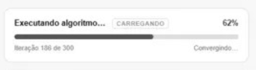

# Microinterface — Loading de Algoritmo

## 1. Introdução à proposta

A proposta é um componente de loading que representa visualmente o processamento de um algoritmo. A interface mostra o progresso em tempo real através de uma barra, exibindo a iteração atual, o percentual concluído e o status do processo.

---

## 2. Rascunhos iniciais

A ideia inicial era fazer umm a barra de progreso do algoritimo da soluçao

Rascunho:

